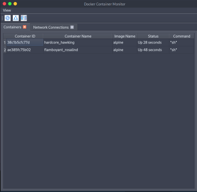
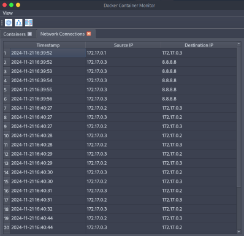
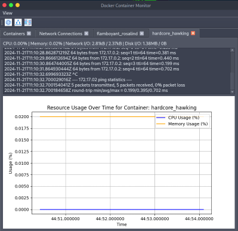
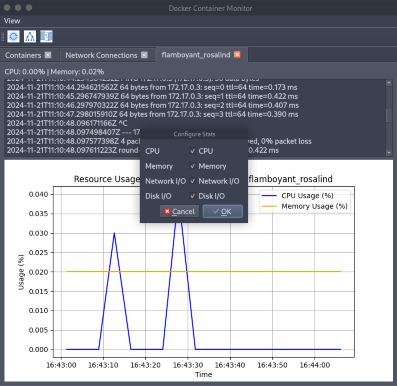

# Docker Container Monitoring Tool  

This project is a comprehensive Docker monitoring application built with **PyQt6**, designed to provide real-time insights into Docker containers' performance, logs, and network activity. The tool is intuitive, interactive, and offers advanced visualization features to enhance container management and monitoring.

## Features  
- **Container Monitoring**: Tracks real-time CPU and memory usage for Docker containers with interactive graphs.  
- **Log Management**: Displays live logs for each container with automatic updates.  
- **Network Activity Analysis**: Captures Docker container network traffic and visualizes IP connections.  
- **Heatmaps**: Automatically generates IP connection heatmaps to highlight traffic intensity.  
- **Network Graphs**: Visualizes communication between containers and external devices.  
- **User-Friendly GUI**: Provides tab-based views, live updates, and customizable settings.  

## Requirements  
- Python 3.9+  
- Docker installed and running  
- PyQt6  
- Additional Python libraries: `pandas`, `matplotlib`, `seaborn`, `networkx`

## Installation  
1. Clone this repository:  
   ```bash  
   git clone https://github.com/your-username/docker-monitoring-tool.git  
   cd docker-monitoring-tool  
   ```  
2. Install the required dependencies:  
   ```bash  
   pip install -r requirements.txt  
   ```  

3. Run the application:  
   ```bash  
   python main.py  
   ```  

## Usage  
- Launch the application to monitor running Docker containers.  
- Navigate through tabs to view container stats, logs, network activity, and graphs.  
- Use the toolbar to refresh containers, view network graphs, or generate heatmaps.  

## Screenshots  
**Main Dashboard**  
 

**Network Activity**  
  

**Network Graph**  


**IP Connections Heatmap**  


**Individual Container Monitoring**  


**Multiple Individual Containers Monitoring**  


**Edit Prefferences for More Stats**  


**More Stats**  


## Other Contributers:
1. [Harsh Upadhyay](https://github.com/itsharu11)
2. [Kartik Iyer](https://github.com/KartikIyerr)
3. [Sourav Kumavat](https://github.com/INDSOURAV)
4. [Mann Patel](https://github.com/Mann2oo2)
---  

**Developed with Python and Docker to simplify container management.**
